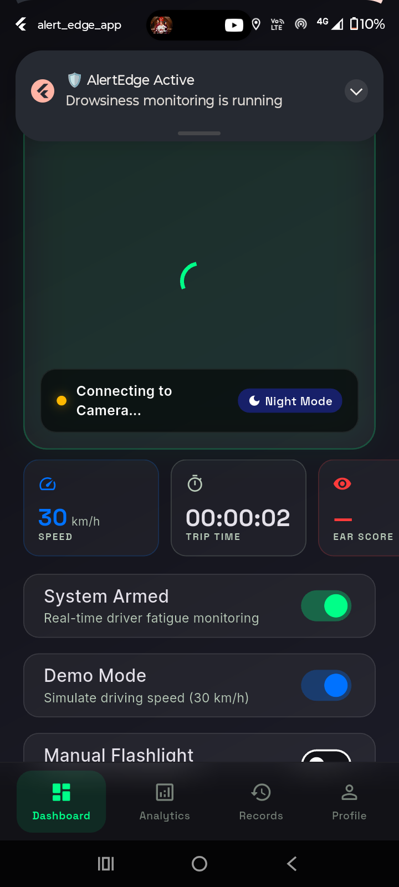
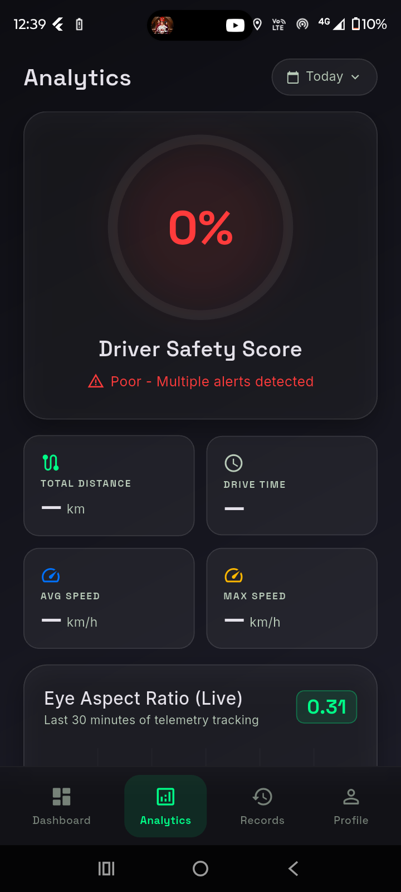
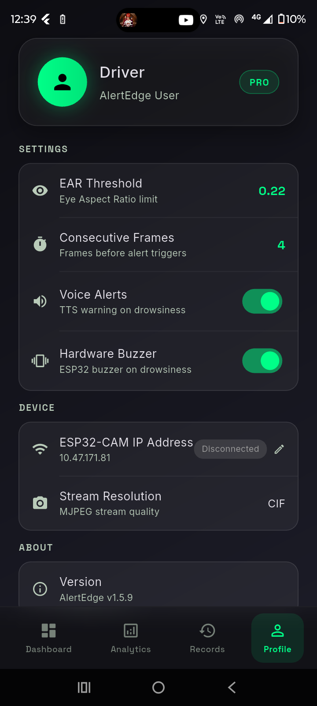
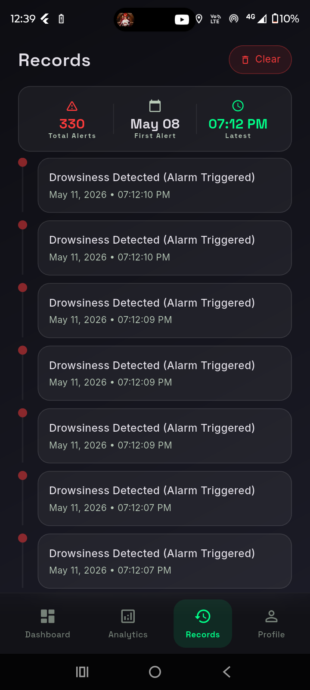
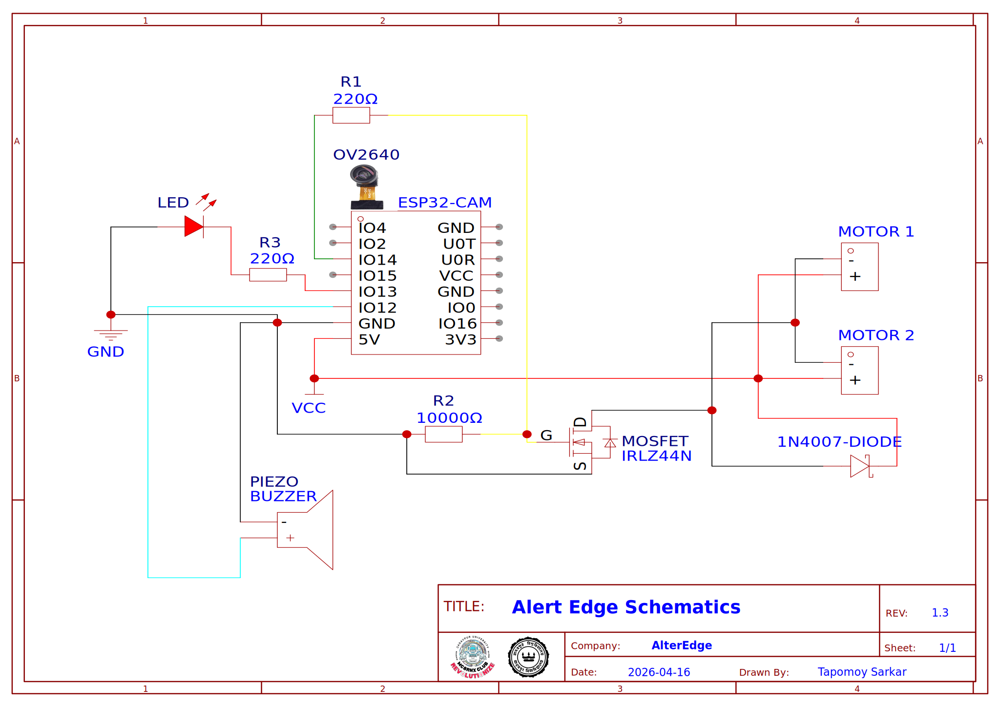

# AlertEdge 🛡️

**A real-time driver drowsiness detection system combining embedded hardware (ESP32-CAM) with an on-device Flutter ML pipeline, smart GPS location services, and background audio monitoring.**

## Demo Video


## 🚀 Features

- **Real-Time ML Pipeline**: Uses Google ML Kit Face Mesh + Frame-based Eye Aspect Ratio (EAR) algorithm running natively on Android/iOS.
- **Hardware Integration**: Connects with an ESP32-CAM over Wi-Fi (MJPEG streaming) for robust, low-bandwidth video feeds.
- **Hardware-Accelerated GPS**: Suppresses alarms when the vehicle speed is 0 km/h (e.g., parked or at traffic lights) using high-precision satellite locks.
- **Dual-Stream Architecture**: Parses raw TCP bytes to split the feed into a throttled display stream (for UI efficiency) and an unthrottled ML stream (for instant processing).
- **Background Protection**: Runs specialized isolate processes to maintain drowsiness monitoring and Voice Notification (TTS) even when the app is in the background or the screen is off.
- **Customizable Alerts**: Configurable EAR thresholds, trigger frames, Voice Alerts, and ESP32 hardware buzzer integration.
- **Analytics & Auditing**: Locally logs every detection instance into an SQLite database with detailed driver safety scores.

## 🛠️ Architecture Overview

```text
ESP32-CAM (JPEG/MJPEG over Wi-Fi)
        |
        |  HTTP port :81  (MJPEG stream)
        v
Flutter App (Android/iOS)
  |-- MjpegStreamer      — parses raw TCP bytes into JPEG frames
  |-- DrowsinessDetector — runs ML Kit Face Mesh + Frame-based EAR algorithm
  |-- GpsSpeedService    — reads hardware GPS for intelligent alarm suppression
  +-- AlarmService       — triggers Conditional TTS + hardware buzzer via ESP32
        |
        |  HTTP port :82  (alarm / flash commands)
        v
ESP32-CAM GPIO
  |-- GPIO 12 — Piezo Buzzer
  |-- GPIO 13 — Vibration Motor (NPN transistor)
  |-- GPIO 4  — Flash LED
```

## 🧠 The Core Algorithm (EAR)

The system calculates the **Eye Aspect Ratio (EAR)** using 478 facial landmarks. EAR is the ratio of the vertical eye distance over the horizontal width.

```text
        ||p2 - p6|| + ||p3 - p5||
EAR = ----------------------------
             2 x ||p1 - p4||
```

Both eyes are processed simultaneously and averaged. A rolling window smooths the EAR readings, and the system waits for `N` consecutive closed frames before triggering an alarm, preventing false positives from random blinking or glasses frames.

---

## 📸 Screenshots

<div align="center">
  
  &nbsp;&nbsp;&nbsp;
  
  &nbsp;&nbsp;&nbsp;
  
  &nbsp;&nbsp;&nbsp;
  
</div>

---

## App Details
* **Dashboard**: Shows the live feed from the ESP32-CAM and the current drowsiness status. Shows speed from GPS.ESP flash can be controlled from here.
* **Analytics**: Shows the drowsiness analytics and historical data.
* **Profile**: Shows the profile information and settings.
* **Records**: Shows the drowsiness records and historical data.

## Circuit diagram

### Protoype circuit 


## ⚙️ Getting Started

### Hardware Setup
1. Flash `CameraWebServer.ino` to your ESP32-CAM.
2. Ensure the camera sensor is an OV2640.
3. Wire the buzzer to `GPIO 12` and vibration motor (optional) to `GPIO 13`.
4. Connect the ESP32-CAM to a vehicle hotspot or local Wi-Fi.

### App Setup
1. Inside the `alert_edge_app` folder, run `flutter pub get`.
2. Build the app using `flutter build apk` (or run it on your device).
3. Connect the app to the ESP32-CAM by entering the ESP32's IP address in the Profile settings.
4. Adjust the EAR Threshold and frame trigger settings according to your lighting and driver characteristics.

#### App Provided APK - app-release.apk

## 🛡️ Privacy & Safety
All machine learning and face mesh processing occurs strictly **on-device**. No video frames or personal data are ever uploaded to the cloud.

---
*AlertEdge v1.5.9 — Embedded IoT x Mobile ML x Background Safety Runtime*
